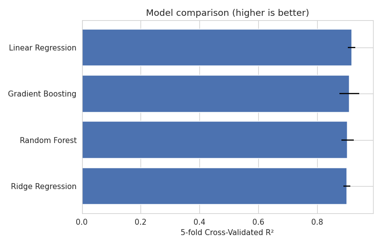
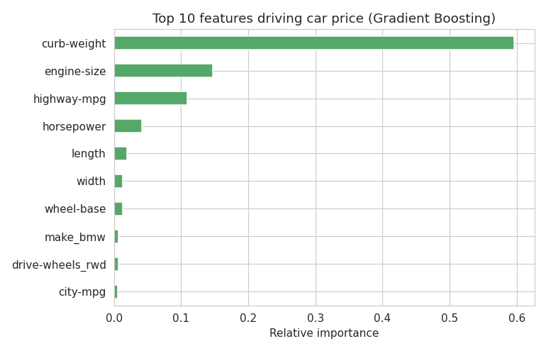

# Car Price Prediction

Predicting car prices from vehicle specifications (make, engine details, body style, fuel economy, dimensions, and more) using regression models, on the classic UCI Automobile dataset.

## Overview

Car pricing depends on a mix of ordinal specs (door count, cylinder count), genuinely unordered categories (make, body style, fuel system), and continuous engineering measurements (engine size, weight, horsepower). This project builds a spec-to-price regression pipeline: cleaning a dataset that encodes its missing values as `"?"`, encoding ordinal vs. nominal features correctly, and comparing four regression models with cross-validation.

## Problem Statement

Given a car's specifications, predict its price (in $). This is a supervised regression problem on a small (204-row), right-skewed dataset with a mix of categorical and numeric features.

## Dataset

`data/cars.csv` — the UCI Automobile dataset: 204 cars, 27 columns (make, engine type, fuel system, dimensions, weight, horsepower, mileage, price, and more).

Cleaning required before the data was usable:

- **`?` is this dataset's missing-value marker**, appearing in `normalized-losses`, `num-of-doors`, `bore`, `stroke`, `horsepower`, `peak-rpm`, and `price`.
- **`normalized-losses` is ~20% missing** and is an insurance risk-rating figure, not a vehicle spec — dropped rather than imputing a fifth of a weakly-related feature.
- **`bore`, `stroke`, `horsepower`, `peak-rpm`, `price` were read as text** purely because of the stray `?` values — converted to numeric.
- **4 rows missing the target price** — dropped (the target can't be imputed).
- **`num-of-doors` and `num-of-cylinders` are ordinal counts spelled out as words** (`"four"`, `"six"`) — mapped to real integers so models see them as ordered quantities rather than arbitrary categories.
- **Remaining small numeric gaps** (bore, stroke, horsepower, peak-rpm, num-of-doors — 2-4 rows each) filled with the column median.

After cleaning: 200 rows, 24 features.

## A critical bug found in the original version

The first version of this project computed a "feature importance" table like this:

```python
x = df.drop('price', axis=1)
x = x.apply(le_x.fit_transform)   # LabelEncoder on every column

DX = x
DX['price'] = y
```

`DX = x` does **not** copy the dataframe in pandas — it's a second name for the *same* object. So `DX['price'] = y` silently added a `price` column back onto `x` too, and `x` was then used directly as the training features:

```python
x_train, x_test, y_train, y_test = tts(x, y, test_size=0.20, random_state=4)
lr.fit(x_train, y_train)
```

With `price` sitting inside `x` as a feature, the model could trivially read the target off itself — producing **R² = 1.0** and **MAE ≈ 3×10⁻¹²**. That's not a working model, it's a variable-aliasing bug. The rebuilt pipeline in this repo constructs the feature matrix with `.copy()`, so it can never alias back onto anything the target gets added to, and never lets `price` leak into the inputs.

The original notebook also ran every column (including continuous numeric ones like `peak-rpm`, `city-mpg`, and ordinal ones like `num-of-doors`) through a single shared `LabelEncoder`, which imposes an arbitrary, meaningless order on genuinely unordered categories like `make` or `body-style`. The fixed pipeline one-hot encodes true nominal categories and converts word-based ordinals (`"four"` → `4`) to real integers instead.

## Methodology

1. **Cleaning** as described above (see `load_and_clean()` in `src/car-price-prediction.py`).
2. **Target transformation** — `price` is right-skewed (a handful of luxury/high-performance cars pull the mean above the median), so the model is trained on `log1p(price)` and predictions are converted back with `expm1()` for evaluation in real $ terms.
3. **Preprocessing** — genuinely nominal columns (`make`, `fuel-type`, `aspiration`, `body-style`, `drive-wheels`, `engine-location`, `engine-type`, `fuel-system`) one-hot encoded via `ColumnTransformer`; ordinal/numeric columns passed through unchanged.
4. **Models compared**: Linear Regression, Ridge Regression, Random Forest, Gradient Boosting.
5. **Evaluation** — both a single 80/20 held-out test split and 5-fold cross-validated R², since a single split on a 200-row dataset is sensitive to which cars happen to land in the test set. CV R² is the primary metric used to compare models.

## Results

| Model | Test R² | Test MAE ($) | Test RMSE ($) | CV R² (mean) | CV R² (std) |
|---|---|---|---|---|---|
| Linear Regression | 0.891 | 1,643 | 3,490 | **0.9169** | 0.0120 |
| Gradient Boosting | 0.969 | 1,358 | 1,860 | 0.9088 | 0.0332 |
| Random Forest | 0.962 | 1,503 | 2,066 | 0.9033 | 0.0208 |
| Ridge Regression | 0.752 | 2,206 | 5,271 | 0.9006 | 0.0112 |

All four models land in a tight **CV R² band of ~0.90–0.92** — strong agreement across very different model families is a useful sanity check that this is genuine signal, not another leakage artifact. Linear Regression edges out the others on cross-validated R², while Gradient Boosting and Random Forest edge ahead on the single held-out test split.

**Feature importance** (from Gradient Boosting): engine size, curb weight, horsepower, and highway/city mileage are the strongest price drivers, along with certain makes carrying a clear brand premium.




## Tech Stack

- Python 3
- pandas, NumPy
- scikit-learn (Linear Regression, Ridge, Random Forest, Gradient Boosting, `ColumnTransformer`, `OneHotEncoder`, `Pipeline`)
- matplotlib, seaborn
- Jupyter Notebook

## Project Structure

```
car-price-prediction/
├── data/
│   └── cars.csv
├── notebooks/
│   └── car-price-prediction.ipynb   # full analysis with narrative + charts
├── src/
│   └── car-price-prediction.py      # standalone script version
├── assets/
│   ├── model_comparison.png
│   └── feature_importance.png
└── README.md
```

## How to Run

```bash
git clone https://github.com/Akash-Nion/car-price-prediction.git
cd car-price-prediction
pip install pandas numpy scikit-learn matplotlib seaborn jupyter

# Run the script version
cd src
python car-price-prediction.py

# Or explore the full notebook
cd ../notebooks
jupyter notebook car-price-prediction.ipynb
```

## Author

**Akash Nion Rahaman**
B.Sc. in Mathematics · Postgraduate Diploma in Data Science
